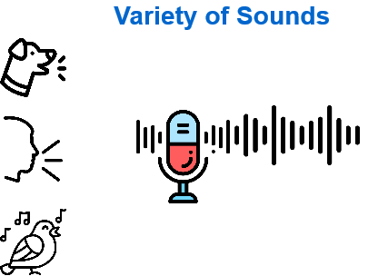

# 简介

你是否曾经好奇我们日常使用的语音助理是如何工作的？ 它们如何理解我们所说的话？

助手必须将语音转换为文本，然后将该文本转换为数字（称为 “单词嵌入”）。 然后，助理对语句进行分类，并将其与意向（说话人希望语音助理执行的操作）相关联。 有关此过程的更多详细信息，请参阅此 PyTorch 学习路径中的“自然语言处理简介”模块。

但是，当出现狗叫声或猫叫声时会怎么样？ 无法将这些声音转换为文本.

在这个学习模块中，我们将学习如何使用 PyTorch 进行音频分类。 有多种方法可以构建音频分类模型。 您可以使用波形、标记波形文件的部分，甚至可以在频谱图图像上使用计算机视觉。 在本教程中，我们将首先分解如何理解音频数据，从模拟到数字表示，然后我们将使用计算机视觉在频谱图图像上构建模型。 没错，您可以将音频转换为图像表示，然后使用计算机视觉对所说的单词进行分类！ 我们将构建一个可以理解“是”和“否”的简单模型。 我们将使用的数据集是开放的数据集[Speech Commands](https://pytorch.org/audio/stable/datasets.html#speechcommands)，该数据集内置于PyTorch [datasets](https://pytorch.org/audio/stable/datasets.html)。 该数据集总共有 36 个不同的单词/声音用于分类。 每个话语都存储为一秒（或更短）的 WAVE 格式文件。 我们将只使用“是”和“否”进行二元分类。

## 学习目标
通过学习本模块，你将能够：

- 了解音频数据的基本特征。
- 了解如何使用声谱图将声音信号转换为视觉图像格式。
- 构建语音分类模型，该模型可使用卷积神经网络 (CNN) 识别声音或说出的话。

## 先决条件
- Python 基础知识。
- 对如何使用 Jupyter Notebook 有基本的了解。
- CNN 基础知识。 （可以从此学习路径中的“PyTorch 计算机视觉简介”模块开始。）